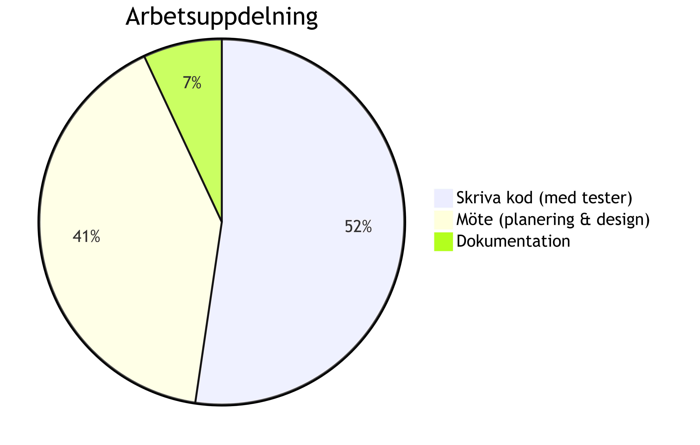

# Projekt rapport

# 1 Grupp
Vår grupp heter O’boy. Nedan följer information om gruppens medlemmar:

| Namn                    | E-mail                                 | Aktiva Datum        |
|-------------------------|----------------------------------------|---------------------|
| Alexandra Barbu         | alexandra.barbu.0105@student.uu.se         | 4/12/2024 - End |
| Albin Carlsson          | albin.carlsson.9644@student.uu.se          | 4/12/2024 - End |
| Einar Eriksson Wahlin   | einar.eriksson-wahlin.5775@student.uu.se   | 4/12/2024 - End |
| Felix Fagerstedt        | email4@example.com                         | 4/12/2024 - End |
| David Julin             | david.carl.julin@gmail.com                 | 13/1/2025 - End |
| Erika Wallin            | erika.wallin.6208@student.uu.se            | 4/12/2024 - End |

# 2 Kvantifering
Vi började projektet 4 december, då vi inledde vår första gruppmöte. Vi kom då fram till att vi behåller kursens struktur 
för deadlines, och bestämde att ha en soft- och en hard-deadline.
    **Soft-deadline**: (ursprungligt) 25/12/2024, ändrat till 1/1/2025
    **Hard-deadline**: (ursprungligt) 1/1/2025, ändrat till 5/1/2025

I kommande möten vi hade, delade vi upp arbetet i fyra olika sprints, nedan följer start- och slutdatum för dem 
(med ändrade datum också):

Sprint   | Startdatum (ursprungligt) | Startdatum (ändrat) | Slutdatum (ursprungligt) |  Slutdatum (ändrat) 
|--------|---------------------------|---------------------|--------------------------|--------------------------
1        | 4/12/2024                 | ändrades ej         | 10/12/2024             | 17/12/2024
2        | 10/12/2024                | 17/12/2024          | 16/12/2024             | 24/12/2024
3        | 16/12/2024                | 24/12/2024          | 19/12/2024             | 1/1/2025
4        | 21/12/2024                | 29/12/2024          | 1/1/2025               | 5/1/2025

Vi skrev totalt: //TODO: 
*    rader C kod
*    rader testkod
*    rader ”script code”

Som ett grupp jobbade vi totalt : //TODO:    antal timmar. Dessa timmar innefattar gruppmöten som vi hade samt kodning 
som gjordes i helgrupp (ej i par).

Vi hade totalt:  //TODO:
*   git commits
*   git issues
*   GitHub issues

# 3 Process
## 3.1 Inception
Processen som valdes för det här projektet är Scrum eftersom vi arbetade med den under kursens gång och alla medlemmar 
var vana med den. Det innebär att dela upp projektet i olika sprintar (delar) som ska klaras under en viss tid för 
att följa utvecklingen. Till skillnad från kursens sprintar där allt var redan planerad och uppdelad så fick vi indela 
arbetsuppgifterna själva, vilket representerade en stor del av planeringen. Vi skapade en Trello-board där vi
kategoriserade olika upggifter till respektive sprint och person. För att säkerställa att vi är på rätt spår så hade
vi vecko-möten där vi diskuterade indelningen av uppgifter samt justerade våra prioriteringar. Vi tycker att denna
process gjorde det lättare för oss att följa utvecklingen av vårt projekt, eftersom med hjälp av Trello kunde vi
visuellt se våra framsteg och snabbt justera arbetsbelastningen. 

## 3.2 Implementation //TODO
In this section, discuss:

what you actually implemented of the process
strengths and weaknesses with your implementation of your chosen process
what you would do differently if you were to start over tomorrow
what successes you would attempt to repeat if you were to start over tomorrow
how plans were made, key plans, and to what extent your plans were followed
how decision making happened, key decisions, and whether they were followed
how did you attack the Christmas break problem with planning?

# 4 Use of Tools //TODO
In this section, discuss:

what tools you used in the project
what use you had of those tools
if there were any tools you were lacking
tools you would rather not use in the future

# 5 Kommunikation, Kooperation och Koordination

Vi kommunicerade med varandra (och med vår coach) via vår Discord kanal som skapades i början av projektet.
Innan "Jul-lovet" hade vi våra möten på plats eftersom vi tyckte det var det bästa kommunikationssättet, men
under lovet håll vi våra möte på Discord. Detta underlättade arbetsprocessen eftersom man kan snabbt "hoppa in" i någons
kanal och fråga något man undrar. 

Vi började att skriva kod i helgrupp, vilket snabbt upptäcktes vara ineffektivt, eftersom det är både svårt och krångligt
att hålla på med samma funktionalitet samtidigt, eftersom olika medlemmar har olika arbetsstilar. Detta ledde till några
förseningar tills vi delade upp arbetsbelastningen i par (och GitHub branches), vilket gjorde att bara en enskild par ska 
fokusera på en specifik del av projektet. Genom att dela upp ansvarsområden kunde vi jobba parallellt samt förtsätta ha 
koll på andras arbete när vi integrerade alla branches i main. 

Vi kan garantera att ingen av våra medlemmar har haft en svår period under projektets gång, vilket vi är glada över. Detta
kan bero på att alla var inkluderade i utvecklingen av den här processen. Vi hade möte när de passade alla medlemmar samt
anpassade arbetsbelastningen så att ingen känner sig överväldigad. Alla medlemmar var flexibla med sina arbetstider och 
kommunicerade öppet, vilket gjorde att vi undvek onödiga stressmoment. 

Som det har nämnts innan, hade vi inga fysiska möten under "Jul-lovet". På varje möte diskuterade vi hur olika par ligger 
till, om någon behöver hjälp eller likt, uppdaterade Trello så alla har koll på hur projektet utvecklas. Efter det fick
paren bestämma hur de vill lägga upp arbetet, dock så har de mesta förtsätt med sina uppgifter under dagen. Vi undvek 
att jobba under röda dagar, eftersom alla behövde ledig tid för att vila samt fira Jul/Nyår.

Under utvecklingsprocessen har vi lärt oss vikten av att överskatta tidsåtgången för en uppgift snarare än att 
underskatta den tiden, och sedan hamna efter i planeringen. I början underskattade vi tiden för vissa uppgifter, 
vilket skapade press när vi insåg att vi ligger efter vårt schema. Vi har också lärt oss att en stor grupp kan inte
jobba på samma uppgift tillsammans, eftersom detta resulterar i att bara några medlemmar kan bidra till uppgiften 
och gruppen förlorar tid. Att arbeta i par eller mindre grupper har visat sig vara en mer effektiv arbetsmetod.
På så sätt kan varje medlem få sitt eget ansvarsområde, arbeta parallellt och i sin egen takt med respektive uppgift. 
Notera dock att detta krävde öppen kommunikation, tillit, och disciplin för att fungera effektivt.

# 6 Work Breakdown Structure

Vi delade upp projektet i fyra sprintar:

## Sprint 1
Denna sprint innefattade fastställandet av desginkrav samt planering av programstrukturen på en hög nivå.
Detta gjordes dock översiktligt i början eftersom vi endast hade diskuterat det och ännu inte skissat en konkret 
struktur för programmet. Sprinten påbörjades den 4 december med ett planerat slutdatum den 10 december. Efter det första 
mötet med coachen insåg vi dock att den planerade implementationen inte överensstämde med projektets avsikt. Flest 
medlemmar var upptagna med inlämningsuppgift 4 under denna period så några förseningar inträffade här, när vi skulle 
omvärdera programmets struktur. Vi fick ändra slutdatumet till 17 december och tänka om vår planering för att ha en bra 
grund inför kommande sprintar. Sprint 1 gjordes i helgrupp för att säkerställa att alla medlemmar kan bidra till 
projektets struktur och få en djupare förståelse för målet.

## Sprint 2
Den andra sprinten hade som mål implementationen av basfunktionerna för skräpsamlaren, samt utveckla tillhörande 
enhetstester. Arbetet påbörjades den 10 december men inleddes med en mindre stabil grund. Avsaknaden av en tydlig struktur 
orsakade en missuppfattning kring hur implementationen skulle utformas. Vi jobbade i helgrupp under en kort stund, men
eftersom detta visade sig vara ineffektivt delade vi istället upp oss i tre par. Varje par tilldelades anvar för 
specifika funktioner och tillhörande tester att utveckla. Under processen insåg vi inte att den tänkta strukturen var 
bristfällig, men det första mötet med coachen gjorde oss medvetna om detta. Vi bestämde oss att gå tillbaka till sprint
1 och tänka om programmet och sedan återvända till den andra sprinten. Att göra detta anser vi vara det bästa valet
som vi har gjort, eftersom det lade en stabil grund för det fortsatta arbetet samt minskade risken för framtida problem,
även om det orsakade några förseningar. Hela planerigenen ändrades,  vi började om den 17 december och satte en deadline
den 24 december istället för den 16.

## Sprint 3
Denna sprinten fokuserar på att skapa olika destruktorer och integrations-/regressionstester. De olika destruktorer med
tillhörande tester tilldelades olika par, men eftersom alla medlemmar behövde ha samma grund för arbetet eller kunde inte
arbeta precis då (under Jul perioden), valde vi att minska antalet grupper eller jobba enskilt när de passade. Detta
resulterade i ett mer fokuserat och anpassad samarbete som alla kunde bidra till. Trots alla förseningar, verkade 
arbetsbelastningen vara rättvist fördelad vilket gjorde att alla medlemmar kunde arbeta effektivt utan större problem.
Precis som alla andra sprints, fick vi ändra slutdatumet från den 19 december till den 1 januari.

## Sprint 4
Den sista sprinten innefattar de sista stegen: att implementera skräpsamlaren i samband med den andra inlämningsuppgiften,
utveckla de befintliga testerna, genomföra små justeringar för att säkerställa programmets funktionalitet,
samt skriva klart de olika dokument som behöver lämnas in (rapporter och presentation). Eftersom implementationen verkade
vara relativt enkel så tilldelades ett par denna uppgift, medan de andra olika medlemmar fokuserade på olika dokument och
genomföra de små ändringar/tester som behövdes. Eftersom den totala arbetsbelastningen var inte jämnt fördelat i slutet, 
valde vi att tilldela större uppdrag till medlemmarna som har arbetat mindre antal timmar, medan de andra fick fokusera
på mindre delar av programmet.

## Arbetsuppdelning

I slutet har vi undersökt vad gruppen spenderade sin tid på under projektets gång med hjälp av en "pie chart". Här är
resultaten vi fick:

Som förväntat visade det sig att största delen av tiden gick åt kodskrivning främst på grund av att vi behövde 
åtgärda fel som gjordes i grundimplementationen. Möten representerar också en betydande del av våra arbetsuppgifter
då många viktiga beslut angående programmets implementation fattades här. Minst tid spenderades på dokumentering eftersom
detta är inte lika tidskrävande och gjordes bara en gång i slutet av projektet. 

# 7 Reflection //TODO
In this section, discuss briefly:

How confident you are that have actually implemented the right thing (why, how, etc.)
On a scale 1–7 (7 is best), rate your satisfaction with your process and provide justification for that number
On a scale 1–7 (7 is best), rate your satisfaction with your delivered product and provide justification for that number
On a scale 1–7 (7 is best), rate your satisfaction with your quality assurance and provide justification for that number
what does the team consider its biggest win?
what does the team consider its biggest fail?

